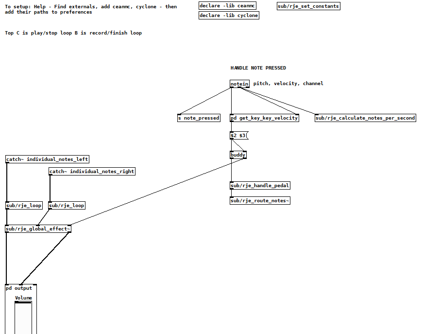

//asciidoc metadata ------------------------------------------
# A prepared digital piano in Pure Data
Richard JE Cooke <Richard.JE.Cooke@gmail.com>
v1
:imagesdir:
:toc: macro
:toclevels: 5
:toc-title: Contents
:sectnums:

// https://asciidoctor.org/docs/user-manual

// table of contents --------------------------------------------
toc::[]

== Introduction
This article describes the creation of a prepared piano created digitally and performed in concert at UCT in 2019.

With 12 000 moving parts, the piano is the most technologically advanced acoustic instrument. In the 20th century, composers tried to make the sound more interesting by attaching objects to the strings, establishing the prepared piano - e.g. Cage's https://www.youtube.com/watch?v=ce4TCth0gGM[Sonata X]. Later the piano keyboard was used in conjunction with digital controllers to create the infinite sonic possibilities of a digital synthesizer.

However, there has been almost no work (other than the https://bitklavier.com/inaction/[bitKlavier etudes by Dan Trueman]) trying to write purely for the piano keyboard while also using the full range of audio effects and timbres digitally available.

I wanted to create a prepared digital piano that uses various audio effects that are triggered procedurally by combinations of notes being played through the keyboard without any other controller input. It is a glimpse of what could be possible if composers wrote standard music notation for piano, while simultaneously writing the effects and sounds that will occur in the piano when those notes are performed.

If you want to run the piano on your own computer it's available at: https://bitbucket.org/RichardJECooke/prepared_digital_piano

== The final product

Here is what the performance sounded like (the pianist wasn't happy with the performance, so it's been blurred).

video::gqsOyC8S85M[youtube, width=700, height=400, theme=dark]

I didn't have time to write a piece so I asked someone to improvise jazz for 4.5 minutes as the weird effects increased from 0% to 10%. It starts getting interesting around 3 minutes. Note the use of the looping functionality in the first half.

== CSound & Cabbage

At first I tried writing the piano in CSound. Cabbage allows you to write a CSound instrument and export it as a VSTi for use in any DAW. This would make giving the piano to others easy for practising, and also allow me to have powerful control over how the effects work.

Unfortunately I found CSound too complicated and strange to learn in the time I had available so I switched to Pure Data.

== Pure Data

This work wouldn't have been possible without the Russian ceammc library of helper patches and effects. This includes: a looper, audio effects, instrument synthesisers, compressors, and list logic helpers.

Here's the main patch:

The midi note comes in, is sent to the pedal patch (which mimics a real piano pedal), then is sent to one of 88 separate patches that produce a sound and add effects. The separate notes' audio is all sent to the left hand side, where it can be stored in a loop and replayed if the player presses the high B and C on the keyboard, and global effects are added that are triggered each time a key is pressed. The chance of a global effect triggering on each keypress is a percentage kept in the `set_constants` patch.

The main problem I had with this instrument was computing power. Computers aren't powerful enough to have multiple soundfonts and effects running separately in real time (at 44100 Hz) for 88 different notes. I thus had to use only two small soundfont instruments (piano & strings), one synthesizer, and one effect - panning. Even using switch~ to disable effects and samples when not in use was not fast or powerful enough to add effects per key.

All other effects (flanger, wahwah, bitcrusher, pitch bend, etc) were added only on the master output. Thus this doesn't truly copy a prepared acoustic piano, but sounds similar.

