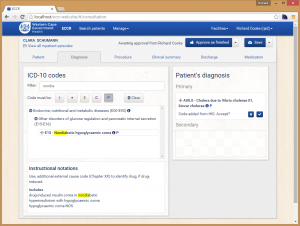
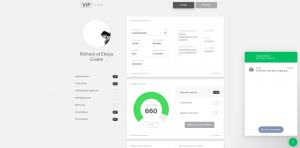
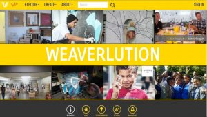

 

## Web apps I've made

 

 | |  | | Weaverlution.com
-----|-|-|-|-
Electronic medical records for Western Cape government hospitals | | Tenant identification & credit check website in the rental industry | | Partnering NGOs with corporate and individual support
 | |  | | 

  
## **Résumé** &nbsp; &nbsp; · &nbsp; &nbsp; *Updated September 2018*

I specialise in front end web development as I love Javascript, but have written all kinds of software: 
- full stack ASP.NET & node.js web sites
- Windows Mobile
- SSIS data transformations & reporting
- .NET Windows desktop apps

 

### Education

#### University of Cape Town

*   **B.Mus** in classical composition (2020)
	* distinctions in composition and history

*   **M.Sc** in computer science by [dissertation](http://pubs.cs.uct.ac.za/archive/00000370/) (2006)
    *   distinction

*   **B.Sc (hons)** in computer science (2004)
    *   class medal
    *   1st in professional communications

*   **B.Bus.Sci (hons)** in finance (2003)

#### Diocesan College (high school)

*   95% matric (school leaving) aggregate

 

### Skills & technologies

#### Management & design
User interface & usability design · Leading presentations & workshops · Leading small teams & being Scrum master · Research & report writing · English

#### Favoured technologies
Linux (Ubuntu) on Windows · Docker 
Node.js with Javascript/Typescript 
Postgresql · git · HTML · CSS (Bootstrap) · parcel.js · Vue.js · Hexo.js · Adonis.js

#### Experienced in
Windows · C# · Moq · Autofac · SVN · Windows Forms · ASP .NET (MVC & WebAPI) · WCF · Microsoft Azure · AngularJS 1 · Underscore/Lodash · bower · SQL Server · Entity Framework · Reporting Services & Integration Services (SSRS & SSIS) · MySql · React.js · Wordpress · webpack.js · Mercurial · hapi.js

  

## Work experience

Year | Organisation | Job | Technology
---- | ------------ | --- | ----------
2017 - 2020 | Studied B. Music
2016 | [Ekaya.com](https://ekaya.com) | Programmer & architect of public web app. Scrum master. | Postgresql · React · Hapi.js · Node.js · Redux.js · MySql · Ruby on Rails
2015 - 2006 | [Saratoga Software](http://saratoga.co.za/) | Consulted at the firms listed below  |
2015 | [HST](http://www.healthsystems.co.za/) | Team leader & Scrum master. Created provincial hospital medical record discharge web app. | AngularJS · ASP .NET WebAPI
2014 | [Weaverlution](http://weaverlution.co.za/) | Lead programmer & part time business analyst. Created public web app for this humanitarian startup | Azure · ASP .NET · SQL Server
2014 | [TEDx Cape Town](http://old.tedxcapetown.org/) | In a team of four, contributed to the open source Android app for this conference. The project website is here | Android
2014 - 2013 | [Direct Axis](http://directaxis.co.za/) | As Saratoga's first representative at a new client, coded enhancements in a large call centre loans application in a team of nine | Windows Forms · WCF
2013 | [Old Mutual](http://oldmutual.co.za/) forensics | CSS stylist for a new Sharepoint web app to handle investigations. Coded SQL data migration from the old system. Designed & coded an allegation logging page for intra-company use. | Sharepoint · CSS · SQL · ASP .NET
2013 | [TEDx Cape Town](http://old.tedxcapetown.org) | Coded a Twitter keyword stream visualisation displayed during the conference  | Javascript · Twitter API
2013 | [Old Mutual](http://oldmutual.co.za/) customer engagement | Coded a WPF application to validate & transfer marketing analysts' file uploads to the leads allocation system  | WPF
2012 |  | As designer & programmer, created client satisfaction reporting dashboards in Reporting Services  | SSRS
 |  | Sole analyst & programmer of a system to transfer data between Old Mutual and the government's Department of Home affairs. This system immediately saved the firm over a million rand a month | sFTP · WCF · ASP .NET MVC
  | | As a temporary BI programmer, imported various data sources using the Kimball methodology to convert an existing data warehouse from Oracle to MS SQL  | SSIS
2012-2010 |  | In a team of seven, imported diverse data sources to create a unified transactional database view of client & intermediary data for marketing analysis. This included social network visualisation work using yFiles for Silverlight | SQL Server · yFiles
2010 | [HST](http://www.healthsystems.co.za/) | In a team of two, rearchitected a medical billing system used in hospitals nationally  | Caché · ASP .NET
2010 | [Saratoga Software](http://saratoga.co.za/) | Team leader for three junior programmers, managed the coding of new features for an SMS based insurance system  | 
2008 | AppointMate | Designed and coded an SMS gateway  | MySQL · Kannel
2007 - 2009 | [Itron](http://itron.com/) | Coded enhancements, including a new workflow framework, for a meter reading client-server system used in Africa, the middle east, & France | SQL Compact · Windows Mobile
2007 | [Hawkins County Gas, Tennessee](http://hcgas.com/) | Maintained & enhanced a natural gas billing system  | Visual Basic · SQL · Microsoft Dynamics
2006 | MedEsafe | Researched & implemented HL7 XML for a new EMR desktop app  | C# · Windows Forms

  
## Sundry achievements

*   UCT \[ZA\]Artsong competition winner, 2019
*   Microsoft qualification: MCTS & MCP in .NET 3.5 Windows Forms (2010)
*   KW Johnstone scholarship (2005)
*   Twamley scholarship (2005)
*   UCT Spilhaus council scholarship (2005)
*   Dean's merit list (2000, 2001, 2017-2019)
*   Department of Commerce entrance merit scholarship (2000)
*   James Owen Brunt scholarship (2000)
*   Grade 8 piano (ABRSM, 2005)
*   Grade 7 guitar (ABRSM, 1998)

  
## Publications

[Link prediction and link detection in sequences of large social networks using temporal and local metrics](http://pubs.cs.uct.ac.za/archive/00000370/) 
UCT masters dissertation, 2006

[Adaptive Bayesian agents: Enabling distributed social networks](http://pubs.cs.uct.ac.za/archive/00000309/) 
South African Journal of Business Management, vol. 37, no. 1, pp. 41-55

[Using Bayesian Agents to Enable Distributed Network Knowledge: A Critique](http://pubs.cs.uct.ac.za/archive/00000221/01/Bayesian_Agents.pdf) 
Proceedings 4th International Critical Management Studies Conference, 4-6 July 2005
