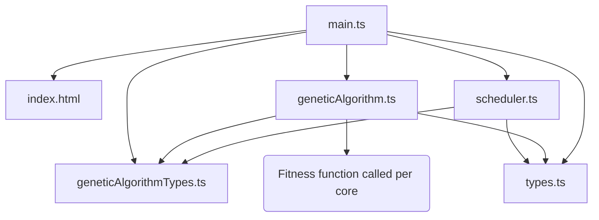

## How to run

```sh
cd richardjecooke.github.io/src/apps/apps/classSchedule;
npm install;
npx tsc;
# browse to index.html
```

## Architecture:


```mermaid
flowchart TD
    1[main.ts] --> 2[index.html]
    1 --> 3[scheduler.ts]
    3 --> 7[geneticAlgorithmTypes.ts]
    1 --> 4[geneticAlgorithm.ts]
    4 --> 7
    1 --> 7
    4 --> 5(Fitness function called per core)
    1 --> 6[types.ts]
    4 --> 6
    3 --> 6
```
