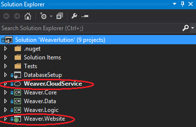
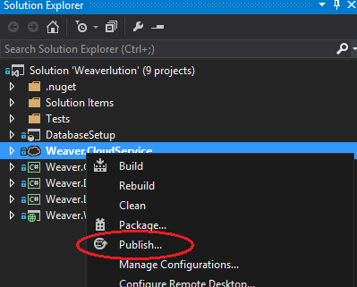
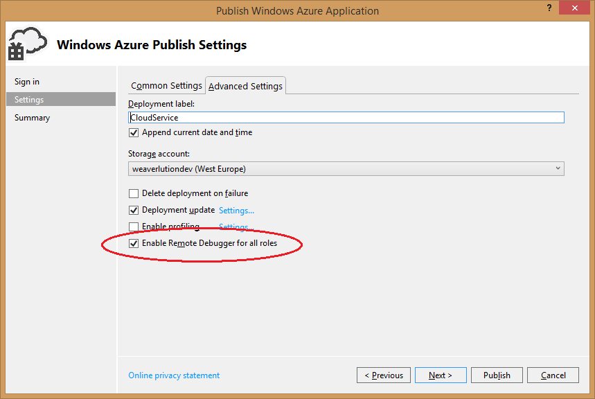
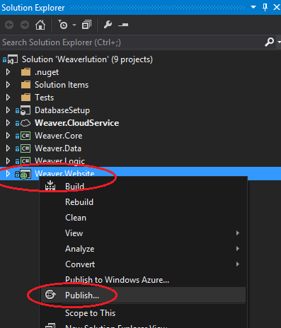
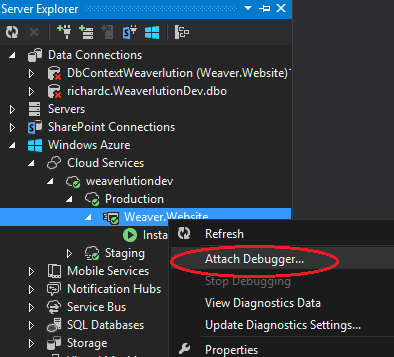

This article briefly describes publishing Azure web applications (web sites in a cloud service), a potential way of doing it faster, and how to debug your site remotely.

## Publishing your application

Assume we have a solution with a cloud service that has a web application, as shown below:

To publish, right click the service, not the site and choose Publish:

In the publish form settings be sure to select all the debug and remote debugging options:

Choosing Build configuration 'Debug' allows the debugger to see symbol information when attaching to the remote process.  When deploying your final production site change this to 'Release'. 'Enable Web Deploy' allows you to deploy the **website** rather than the **cloud service** in future publishes.  I.e. the deployment won't instantiate a whole new virtual machine like it normally does, it will just copy the the application files to the existing instance.

## Publishing with Web Deploy to deploy to Azure faster

Allegedly Web Deploy deploys faster than a full publish because its just copies files, and doesn't create a new instance.  However I found it to be no faster than a full publish (20 minutes on average).  But give it a try, maybe it will work better for you. To web deploy, publish the website, not the cloud service:

## Remote debugging

To remote debug follow these steps:

1.  Publish your application, as explained above.
1.  Browse to it in a web browser (if you don't do this it won't start the IIS process for you to attach to).
1.  Open Server Explorer in Visual Studio, browse to Azure, and attach to your process (it will be called w3wp.exe, the same as a local IIS instance).
1.  Debugging works as normal from here on, except slower.

