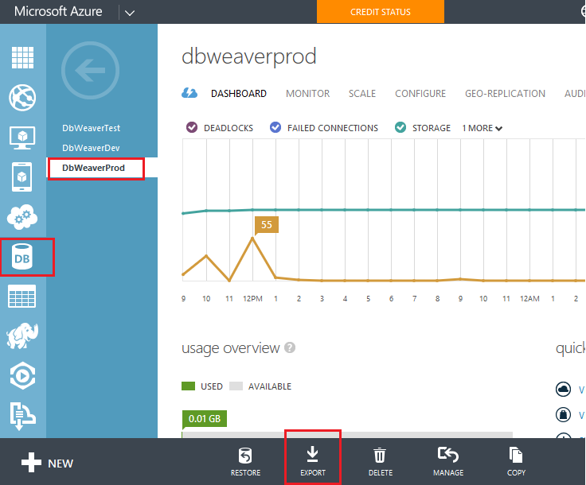

This article demonstrates how to migrate (copy) one Azure database to another and any associated files.  For example, you may want to copy your production database to your test (preproduction) environment to have more recent test data.

## Export (backup) your production database

You need to save it in a storage account.  Here I use our dev storage account, creating a new container for database-backups. 

## Delete the database you want to restore
Since you cannot overwrite a database in Azure you unfortunately first have to delete the database you want to restore. 

## Restore the backup file to a new database
Restore the backup file by creating a new database via import

## Finally, ensure you name the new database with the same name as the one you deleted.

## Copy your storage account
Don't forget that you might also need to copy all the files from your prod storage account to your test storage account too.  For example, where users upload photos that the database points to. [Stackoverflow](http://stackoverflow.com/questions/8582145/copying-storage-data-from-one-azure-account-to-another) suggests PowerShell & AzCopy, but I found it easiest just to use [CyberDuck](https://cyberduck.io/) and manually copy and paste.
