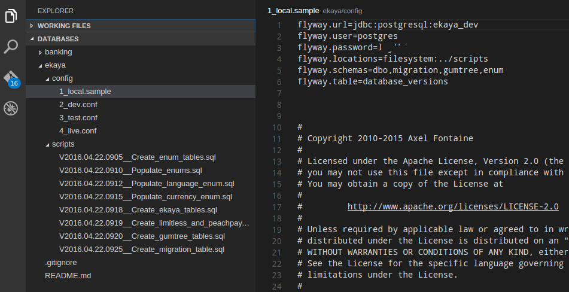

If you follow this setup tutorial you'll have

*   Flyway installed
*   database upgrade scripts
*   configuration files for your local machine, dev server, test server, live server

I presume you're working on Linux or Apple. Windows doesn't change much, just environment variables and path slashes.

## Let's begin

1.  Download Flyway and unzip it into **~/apps/flyway** (or wherever you want)
1.  Put it in your ~/.profile: `export PATH=$PATH:~/apps/flyway`
1.  Restart
2.  Make a repository or folder to hold your database upgrade stuff
3.  For each database you want to maintain make a folder with its name
4.  In the folder, make a folder called **scripts** and one called **config** (or whatever you want to call them)
5.  In scripts, add all your upgrade scripts
    *   Start them with the letter V (Flyway requires this), followed by the creation date and time to ensure they're unique and in the right order, followed by two underscores and then a description of the upgrade
6.  In config, add four config files as shown in the screenshot below (you can move the original config from the Flyway install folder):
    
7.  You can see I have a database called **ekaya** in this example.
8.  In the local sample file I have set the connection details to my local database. Each user of this project will copy this sample on their local machine to **1_local.config** and set their own username and password (.gitignore **1_local.config** to keep it safe).
9.  Don't save the password in any of the server config files (2 to 4). Instead you'll type it in on the command line every time you want to upgrade the server
10. Finally, create a database that you want to upgrade (e.g. in my case its **ekaya_dev**, my local copy of the server's **ekaya_dev**).
11. Now you can run Flyway, from a command line in the config folder (for relative paths to work):
    *   flyway -configFile=./1_local.conf migrate

You're done. Your database should be updated with all scripts. To delete the database just run the same command, but replace **migrate** with **clean**.

For the server config files, change the url. And run them similarly, e.g.:

`flyway -configFile=./2_dev.conf migrate`
