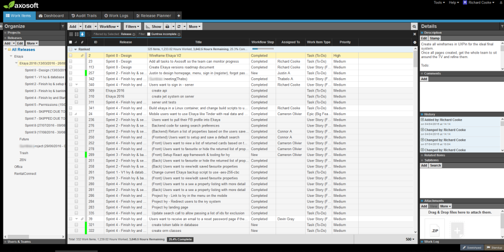
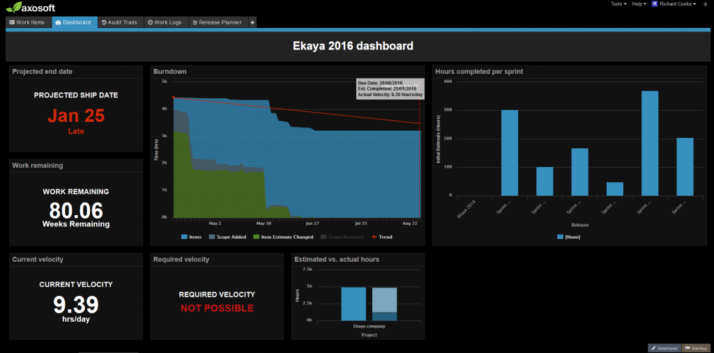
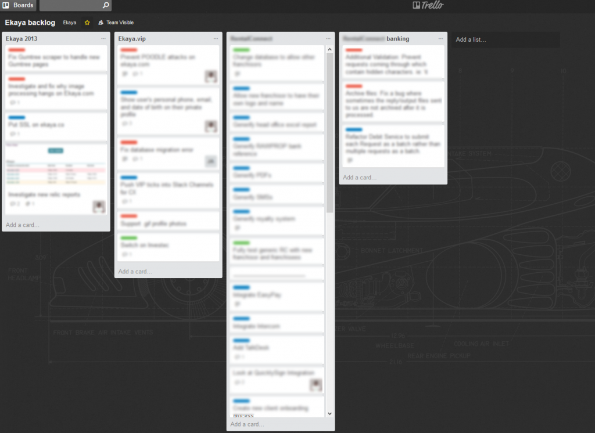
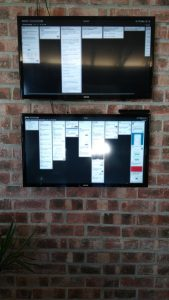
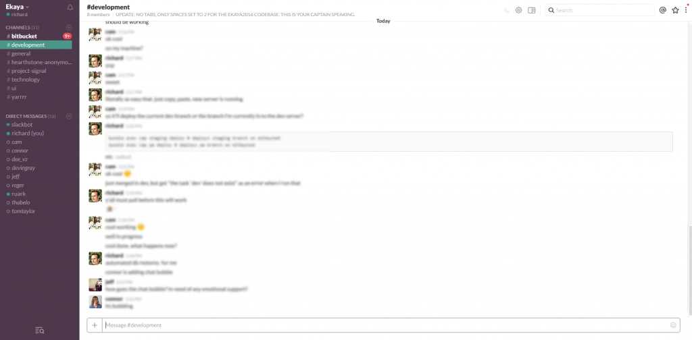
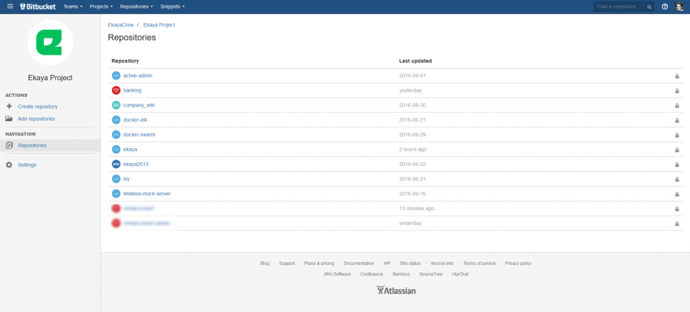
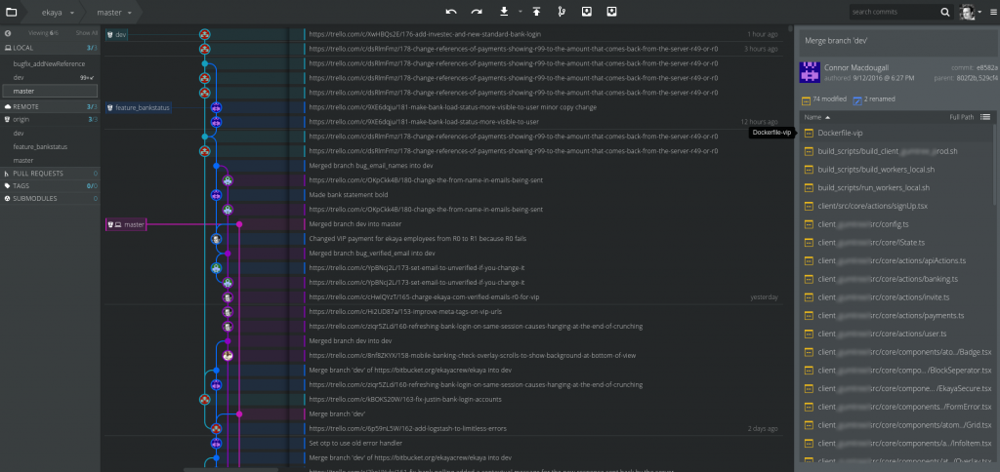
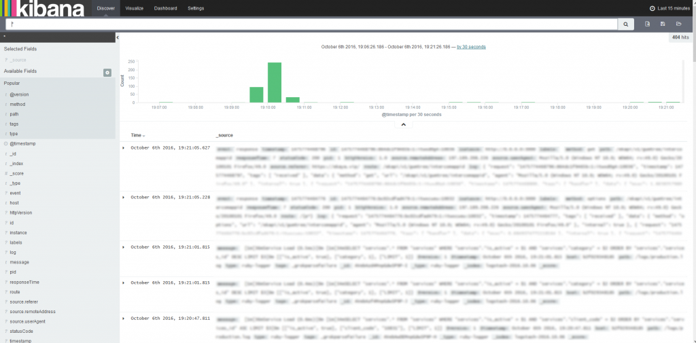

I've just finished & released my new project, [https://ekaya.vip](https://ekaya.vip), as part of the team at [Ekaya.com](https://ekaya.com).

This blog discusses the web app and its creation, similarly to my earlier review of the Angular medical record app, [ECCR](/articles/2015/eccr-the-western-cape-government-health-web-application-for-discharges/).

## The app
Vip is a web app that creates a profile page for a user showing her: verified personal details, credit score and bank statements, and character references.

The user can then share this profile with prospective landlords as an indication she would be a good tenant. Here's part of the profile page for a user:

The screenshot below shows how a landlord (non-user of Vip) can email anyone asking them to create a profile for review:

Finally, the image below shows bank login, part of the profile creation process:

Currently it costs R99 to create a profile, and R49 to optionally refresh all your verified data after three months.

## Office & team
Our office was in leafy green Newlands, holding six programmers, two business people (one customer experience and one designer), and two customer support people.
]

This was one of the best teams I've worked with: no rockstars, no hostility or insecurity, and no laziness. Everyone at the firm was passionate about software - always posting links to interesting tech articles and videos, discussing past- and side- projects, and generally having fun coding something beautiful.

## Design
The app has few screens - it's just a payment screen, some id verification question screens, bank login screens, the main profile screen, and sharing screens. Thus design was completed by the designer/CEO before coding began and all wireframes were small enough to fit on our office wall:

We hired a team in the Ukraine to create the CSS for our wireframes to save time. Which was a terrible idea. Old fashioned Bootstrap CSS is very hard to cut up and put into React components using CSS modules. Never again.

## Project management
We tried out lots of online project management web apps, looking for the set of features we wanted at the best price:

*   task lifecycle managements and grouping into stories and epics
*   automated burndown chart creation

### Axosoft
Axosoft seemed decent and we trialled it for a month.

However it has serious flaws and we wouldn't recommend it because it:

*   is very slow
*   refreshed the task backlog constantly, making you lose your place
*   is far too cluttered with too many unnecessary features
*   makes moving tasks around difficult
*   makes finding out how to do something obscure and difficult
*   and no one wants to enter work logs, or does them accurately

Furthermore the automated time tracking and estimation features were hard to use. Even now I can't remember exactly what combination of estimated time, work logs, and work completed entries you are supposed to use generate correct graphs. Which is unfortunate as they look quite useful:
]

### Trello
Since our time estimates as a team were unhelpful and Axosoft was cluttered we decided to try something completely different. We:

*   switched to the free version of Trello
*   stopped grouping tasks
*   stopped assigning points or hour estimates
*   and had only two boards:
    1.  company backlog (big long-term stories)
    2.  current sprint (small tasks)

At the end of every sprint I made a new board with the date of that sprint and moved all our **done** and **rejected** cards into that board and closed it. Thus our current sprint board never closes, so people don't have to update their bookmarked urls and I didn't have to copy and paste lots of cards and columns.

### Standups & teamwork
We permanently displayed both boards on our TVs and had daily standups around them.

Standups happened whenever everyone had arrived at the office, sometimes only 11h30. When people were working from home they could Skype/Hangouts in, or we'd just skip a day's standup.

### Process
Tasks went from **backlog** to **coding** to **code review** to **deploying** to **testing** (done by our CXO / unoffical QA tester). We started off tackling tasks separately to get through them faster.

But I think this ended up making us slower than if we had collaborated and code reviewed more. At the end of of the project we switched to peer programming at least hour a day for those who were willing. And put every task through code review before deploying it.

## Pair programming
I used to dislike this activity when I first tried it because:

*   it's exhausting
*   I got lost or one of us wasn't contributing
*   it was not ergonomic - trying to share a keyboard and fit behind one screen

With a few changes though I now am very happy with it:

*   Only one person handles the mouse and keyboard, at their pc
    *   This removes the awkwardness of other people disrupting your personalised setup
*   The person at the pc must always be the less experienced on a feature, or on the technology, or as a programmer in general. This ensures
    *   they learn by doing (coding) while the other person talks
    *   they can slow down and look around and ask questions without being rushed as they would be having the more experienced person at the keyboard
    *   they always contribute and can't get lost, as would happen if the person who has all the knowledge also zooms around the code and does all the typing
*   We do it only for a few hours a day, so everyone has lots of personal time to code in silence and relax listening to YouTube or checking Facebook or whatever.

## Apple / Ubuntu
All the coders have Apple PCs, except me. I find the Apple OS difficult to use, unpleasant, and their computers overpriced even with all their deficiencies compared to Windows computers.

So the company bought me a Windows laptop. It is far more powerful than the Apples in the office, at a fraction of the price. I installed Ubuntu on VirtualBox on it to program and had no problems with this setup. 

Ubuntu is necessary to use the same shell scripts as the Apple machines, which Windows can't do easily just yet. I also found working in a VM advantageous at times because of its ability to save and restore images - especially before upgrading my system.

### VirtualBox
I used VirtualBox happily, except for one graphics bug. You need to download and use the guest additions ISO for 5.0.16 until this [bug](https://www.virtualbox.org/ticket/15526) is fixed. Any images later than that version will cause graphics errors in VirtualBox Ubuntu with apps like Gitkraken, Atom, Chrome (and other Electron apps too I assume). Here's the ISO to use: [http://download.virtualbox.org/virtualbox/5.0.16/VBoxGuestAdditions_5.0.16.iso](http://download.virtualbox.org/virtualbox/5.0.16/VBoxGuestAdditions_5.0.16.iso)

### Linuxbrew
The Apples use **Brew** as their package manager, whereas Linux uses **apt**. Apt needs to run as root (all apps are installed globally) whereas Brew installs apps for the local user. This makes things like accessing a database different, as using Brew you don't need to set a password because your current user already has access.

In future to avoid these differences in setup I'd like to give Linuxbrew a try - a fork of Brew compiled for Linux.

## Slack
We used the free version Slack for almost all team communication. It was my first time trying it, having used Gmail & Hangouts before. I like Slack's channels and ability to link to bots, like git commit. But I don't like that messages can whizz by ignored by users if they miss them, unlike email which has to be addressed consciously.

And I detest that that messages get deleted past a certain number, making searching for important old comments impossible. I'd stick with Gmail & Hangouts again in future I had the choice.

## Passpack
We stored all our passwords in the Passpack free version, including our config files for deployment. No passwords were kept in git, meaning we could open source our code safely at any point if we wished. Passpack worked well.

Our passwords were saved to environment variables on our server and not needed to be entered during deployment - as per the 12 factor app best practice guide.

## Bitbucket
We kept our repositories in Bitbucket. The only difference between Bitbucket and Github is that Bitbucket charges per user for an infinite number of repositories and Github charges per repository for an infinite number of users.

The former is clearly far more preferable for a firm with a set number of employees.

## Other online services we used

### Peach Payments
Peach Payments is a credit card payment gateway that is easy to use with a support team that responds quickly. The only problem I have with it is that they have no API for testing.

So if you want to write automated tests to see how your app behaves when payments fail or succeed for various reasons you are out of luck. Hopefully they'll add this useful feature someday.

### Intercom
Intercom provides the chat bubble on our app. Intercom's app provides a profile for each user with their full chat history, and any events or data our app has stored in Intercom for that user.

It can also send emails.  A very useful tool I'd recommend.

### Yodlee
We worked with a local partner to leverage Yodlee’s services and consumer credit checks via an API. The API had it’s problems though:

*   It uses HTML error codes as custom error codes, in inconsistent ways
*   They don't version their API, and make breaking changes in QA
*   Their test server connects to live banks
*   Their documentation doesn't match their API

## Gitkraken
Gitkraken is the only cross platform git GUI, written in Electron. I prefer it to SourceTree, but perhaps not as much as Tortoisegit. But it worked well on my Linux machine.

Watching the other coders in the office struggle to recall and correct lists of git command line statements instead of clicking one button on a GUI was laughable. I'd definitely recommend Gitkraken to anyone in future.

## Atom & IDEs
Two of us used Atom as our IDE (our language was Typescript). One used Jetbrains Webstorm. One used Visual Studio Code. And two used Sublime.  We had no conflicts.

Atom worked perfectly for me. The Sublime users had difficulty installing the Typescript and linting plugins. And nearly all of us used Visual Studio Code for debugging the node server in compiled Javascript because it was powerful and easy to use.

I would not recommend Sublime. Sublime is significantly slower to code in, losing the power to jump directly to declarations in code, find usages, and refactor / rename easily. I did miss having Notepad++ on Ubuntu on several occasions when I wanted to record and run macros, and do clever regular expression search and replaces. But the handy thing about being on an Ubuntu VM was that I could swap back to Windows to run Notepad++ when necessary with one click.

## Coding the app

### Language choice
We'd heard only good things about React & Redux & Typescript, so we chose those for the browser code. Typescript is wonderful in many ways:

*   it provides all the power of statically typed languages (and every new language these days is statically typed, no one wants to use dynamic languages anymore)
*   it's almost identical to Javascript
*   if you want to get rid of it at some future stage you can just compile it to almost identical Javascript and use those files as your files

For the server we had far more choices:

*   Nodejs – same language for front and back end. Typescript allows static typing. Mostly but not completely OO and functional. Means you can use the same JS libraries in both server and browser and share code libraries we make too – hopefully faster easier coding. Politically neutral (the Switzerland of languages to .NET & Java people)
*   Scala – speed and libraries of the JVM. Fully OO and functional. But we'll still have to use a different language for front end stuff.
*   Python – bad static type support using comments. Kinda OO and functional.
*   Ruby – no static typing at all, blocks vs clean first order functions like Python. Full OO.
*   Haskell – beautiful but super difficult so can't hire new coders
*   Clojure – no static types. Lots of brackets.
*   Elixir – too new
*   Go – too new. Controversial on forums. Has an ugly gopher mascot
*   Java – too verbose, no functional supporting
*   Rust – a systems level language with manual memory management
*   F#, C# - bad Linux support
*   Dart – is dead

Typescript with node.js and Scala with Java were the clear top two choices. In the end we chose Typescript because:

*   I had experience in Typesript and no one had experience in Scala
*   We liked the idea of learning only one language
*   node.js fits well with Docker and scalable web apps

We were happy with our choice.

### Docker
We used Docker to create small rebuildable images to deploy our code to test and production.  It's the an excellent technology and the way of the future.

There's nothing more to say - except perhaps that is difficult on your localhost in one regard for people using Apple or Windows pcs. If you pull your packages (e.g. npm, gems, nuget) off the Net every time your container builds then it's very slow to change a line of code and see what the effect is on your site immediately. 

You can share a packages folder between your local machine and the docker machine if you're on Linux so you don't have to update packages every compile - but you can't on Apple/Windows, because the packages are built for a different operating system.

And also, the images take up quite a bit of space - better to have a big harddrive than a small SSD. I had no trouble with speed, but colleagues did have trouble with space.

#### Deployment - scripts, docker-swarm, Kubernetes
At first we wrote simple deployment scripts for our dev server. They ssh'ed onto the server, copied across the code, and ran the dockerfile. For production the guy who was tasked with improving deployment first tried Kubernetes - as we'd heard it was the best. But he found it too hard and swapped to docker-swarm.

When I look at the docker-swarm code I still don't understand it - it's complicated stuff. But it works - we have always online blue/green deployments to production. I'd like to give Kubernetes a try in a future project.

### Tabs vs spaces
I've assumed for years that spaces are dead - because tabs allow everyone to set their preferred length of indentation. But the team eventually decided to pick two spaces (or soft tabs) as the standard as it allows aligning columns and is the Facebook standard. It really made no difference to anything - once everyone had set their darn IDE to the same setting.

### Logging
Our logging is the ELK stack (ElasticSearch, Logstash, Kibana). I didn't work on it so I can't comment.

### Email
We used Sendgrid to send emails, queued in RabbitMQ (a base Docker image).

Sendgrid works well, and has templates.

### Database
We used Postgres.

#### Script management (migrations)
We used Flyway.

#### Sequelize.js
Sequelize is the ORM for Node. An ORM's main benefits are:

1.  You need change only your table model when you change the database, and don't need to update every SQL query that references that table
2.  The ORM automatically handles converting linked database tables to a tree view of objects in code
3.  You'll write less code than custom SQL queries

The problem with Sequelize is it's very poorly documented. I couldn't figure out how to properly associate linked tables in complex cases (where Sequelize presumes you'll use their format, and we used our own).

So we gained benefit number 1, but not so much numbers 2 and 3 - as we ended up writing some custom SQL and conversion code anyway. I'd use Sequelize again, but only until something better and simpler arrives.

### hapi.js
This was our API webserver (like express or koa). We chose it as it's made by Walmart for massive speed. It works well.

But I'm sure the others would be fine too - as they don't really do that much work. I did miss the power and in-the-box features that frameworks like Laravel provide. Strongloop didn't look appealing.

But in my next project I'd love to try Adonis.js.

### Other packages
*   inversify.js - dependency injection
*   tape-async.js & faucet.js - for unit & integration tests
*   request-promise - for REST calls
*   sharp.js - for image resizing
*   nightmare.js - a browser tester (like Selenium) but based on Javascript (Electron) and can run headlessly to test anywhere. It is great, except at handling iframes, which made it impossible to test our credit card payments. I'd still use it again.

## My experience of open source
Having used Linux & open source tools now, after being a .NET programmer for nine years, I wouldn't go back to Windows. Everything is so much easier on Linux:

*   Everything has a CLI that you use to automate every task
*   Package managers make life easy.
*   SSH keys over remembering passwords
*   Framework versioning like rvm and nvm over installing one version of .NET in exactly the right order

However I don't like the generally dynamically typed tendency in old open source languages like Ruby & Python. Python now has types, as does Typescript, and PHP does partially too.

But languages like Ruby I find to hard to use: no find references, go to definition, or refactor, make navigating code incredibly tedious.

## English
I was not involved in writing the copy nor proofreading it. I personally [dislike the German looking title case the app uses](/articles/2015/prefer-sentence-case-to-title-case/). So if you do too, please don't judge me by the app's text.
