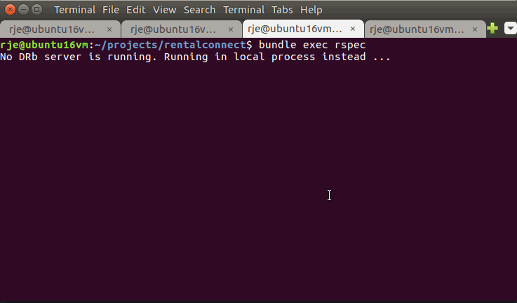

Are your tests too slow because each one recreates the database?  Run them all in memory to make them rapid.  This will work for any database and programming language.

My example here uses MySql, Ruby on Rails, and Rspec. Here's how fast my tests ran before: 

And after:


## How to
(I use docker because I assume you already have a local database that you don't want to move entirely into memory, but if you don't have one already then you don't need docker - just install MySql locally into your tmpfs.) Install docker-compose if you don't have it:

```bash
sudo -i
curl -L https://github.com/docker/compose/releases/download/1.9.0/docker-compose-`uname -s`-`uname -m` > /usr/local/bin/docker-compose &&
chmod +x /usr/local/bin/docker-compose
exit
```

Now create a docker-compose.yml file for your test database (I put mine in script/test/test.sh).

Note that it uses your pc's /dev/shm folder, which is entirely in RAM:

```yml
version: '2'
services:
  db:
    image: mysql
    restart: always
    environment:
      MYSQL_ROOT_PASSWORD: example
    volumes:
      - /dev/shm/mysql:/var/lib/mysql
    ports:
      - 33006:3306
```

Set your test database connection in your config/database.yml file:

```yaml
test: &test
  adapter: mysql2
  host: 0.0.0.0
  database: rc_test
  username: root
  password: example
  port: 33006
```

And finally create /script/test/test.sh to run everything:

```bash
#!/bin/bash

clear
set -e # any commands which fail will cause the shell script to exit immediately
set -x # echo off (-x for echo on)

#----------------------
echo ""
echo "Run this command from the project root folder (./script/test/test.sh)"
echo "(Before running this for the first time run: cd script/test && docker-compose up)"
echo ""
cd script/test
mkdir -p /dev/shm/mysql # /dev/shm is a RAM folder (tmpfs)
docker-compose up -d #detached
sleep 2 #wait for containers to start
cd ../..
mysql -h 0.0.0.0 -P 33006 -u root -pexample -e "DROP DATABASE IF EXISTS rental_connect_test;"
mysql -h 0.0.0.0 -P 33006 -u root -pexample -e "CREATE DATABASE rental_connect_test;"
RAILS_ENV=test bundle exec rake db:migrate
bundle exec rspec
cd script/test
docker-compose stop
cd ../..
```

Now run your tests by typing `./script/test/test.sh`.

## Apple

The above works on Ubuntu. For OSX you'll first have to create your own RAM disk in place of /dev/shm:

```bash
hdiutil attach -nomount ram://$((2 * 1024 * 500))
diskutil eraseVolume HFS+ RAMDisk /dev/disk2
```

Alternatively you can use a database inside a Docker container (because that container has its own RAM disk folder already). Then whenever you start that container, you'd run this script inside it to move the MySql data folder into RAM:

```bash
start_mysql.sh
/etc/init.d/mysql start &&
/etc/init.d/mysql stop &&
cp -R -p /var/lib/mysql /dev/shm &&
sed -i -e s,/var/lib/mysql,/dev/shm/mysql,g /etc/mysql/my.cnf &&
/etc/init.d/mysql start
```

(Remember this has to run every time you start the container because RAM disappears after you turn off a computer)

## Update (a much easier way)

[StackOverflow](https://stackoverflow.com/questions/42226418/how-to-move-postresql-to-ram-disk-in-docker) has given me a much easier way than the above. Docker takes a --tmpfs flag that mounts a memory folder for you. Here's an example for Postgresql:

`docker run -d --tmpfs=/pgtmpfs -p 6000:5432 -e PGDATA=/pgtmpfs postgres:9.6`
