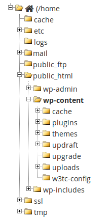

This post explains

*   how to run Wordpress in a Docker container connected to MySql in a Docker container
*   how to restore your existing Wordpress site to the local copy in Docker.

It is written for Ubuntu Linux, but should work identically on OSX or Windows if you're using Docker-machine.

## Install Docker-compose
I assume you've installed docker already, just Google it otherwise. I then tried installing docker-compose with LinuxBrew but got errors trying to run it. So rather install docker-compose natively:

```bash
sudo -i
curl -L https://github.com/docker/compose/releases/download/1.9.0/docker-compose-\`uname -s\`-\`uname -m\` > /usr/local/bin/docker-compose
chmod +x /usr/local/bin/docker-compose
exit
```

## Create the shared folders
This will allow us to edit the Wordpress themes & things from our host:

`mkdir -p ~/projects/wp`

## Create the docker-compose config file and run it
```bash
vim ~/projects/wp/docker-compose.yml
```

```yaml
version: '2'
services:
  db:
    image: mysql
    restart: always
    environment:
      MYSQL\_ROOT\_PASSWORD: lkj
    volumes:
      \- ./mysql:/var/lib/mysql
    ports:
      \- 60001:3306
  wordpress:
    image: wordpress:latest
    restart: always
    depends_on:
      \- db
    links:
      \- db
    ports:
      \- 60000:80
    environment:
      WORDPRESS\_DB\_PASSWORD: lkj
      WORDPRESS\_DB\_HOST: db
    working_dir: /var/www/html
    volumes:
      \- ./data:/var/www/html
```

```bash
\# :wq  to save and quit vim
docker-compose up   #and later just docker-compose start / stop
```

You can now browse to http://0.0.0.0:60000 and install Wordpress.

(And use Mysql Workbench to view the database on the port 60001).

## Restore your existing site
Once you've installed Wordpress you can see all the files in ~/projects/wp/data. Download your backup .zip files (I assume you're using something like UpdraftPlus to Dropbox) and unzip them all somewhere. Now copy all the unzipped folders into the ~/projects/wp/data/wp-content folder so it looks like this:



Note you'll have to use the console to copy the files around because your user won't have permissions to the docker volume.

Try something like this, assuming you're in the wp-content folder:

```bash
sudo cp -r ~/unzipped/* .   # copy files here
sudo chown -R www-data *    # set the owner to docker
sudo chmod -R +rwx *        # give everyone rights to everything
```

### Restore database

Add the following code to the top of your database restore script (to avoid the error **Error Code: 1067. Invalid default value for 'user_registered'**):

```sql
SET SESSION sql_mode = 'NO_ENGINE_SUBSTITUTION';
-- SELECT @@GLOBAL.sql_mode;
drop database wordpress;
create database wordpress;
use wordpress;
```

And this code to the bottom:

`update wordpress.wp_options set option_value='http://0.0.0.0:60000'`  where option_name in ('siteurl', 'home')

Run the script:

`mysql -h 0.0.0.0 -P 60001 -u root -p < restore.sql`

### Browse

You can now use your site at either 0.0.0.0:60000 or 127.0.0.1:60000 or localhost:60000 depending on your exact combination of operating system, virtual machine, docker-machine, and docker-compose.

Remember to close and reopen your entire browser and incognito windows each time you try to avoid caching errors.
