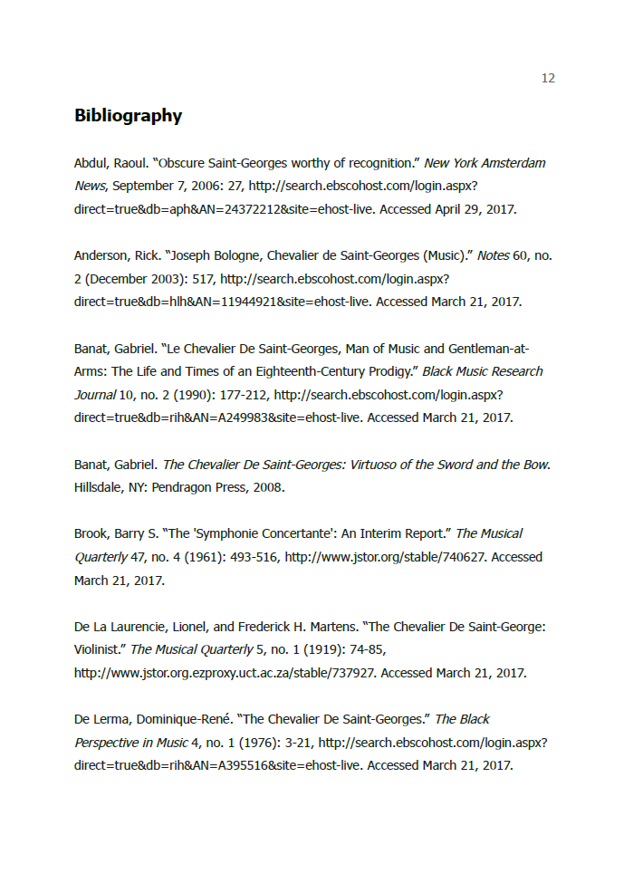
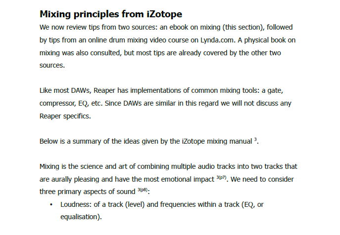
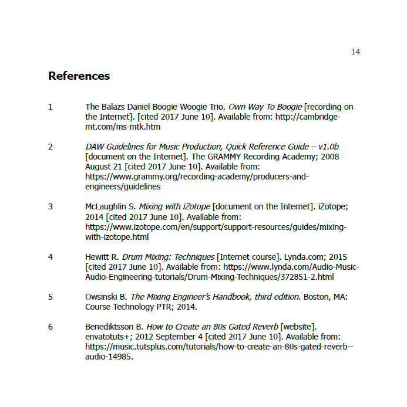

If you do any academic writing you have to cite your sources using a referencing system. Sadly you probably have to use whatever system is the norm in your field, but if you have a choice which is the best to use?

The short answer - the ACM or Vancouver system.

To see why, read my ranking of the three common systems below.

## The horrible: footnotes (Chicago)

In this system every citation is a footnote at the bottom of the page consisting of the source's entire details, in a slightly different format to the source's details in the bibliography. Differences include ridiculous things like swapping the order of first name and surname of authors.

It looks like this on the page:

It looks like this in the bibliography:

It's horrible because:

*   The footnotes take up a huge amount of unnecessary space making your writing look cluttered and ugly.
*   You have to copy and paste the entire footnote line for every citation.
*   You have to write and maintain two entirely separate lists of sources with tiny formatting differences - one for the footnotes and one for the bibliography. This makes it impossible to use any citation software tool because they all keep source lists in just one format.
*   Whenever you change the the order of citations you have to check if you're referencing a source for the first time due to your change, because there's yet ANOTHER way of referencing sources that have been mentioned before.
*   Whenever you change the order of citations you have to check if you're referencing the same source as the previous line, because there's a FOURTH way of referencing sources from the previous line: 'ibid'. (I kid you not, there are seriously four ways of referencing one source in this monstrosity of a system.)

The amount of extra work this system creates is disgusting. I'm stunned it is still in use in 21st century academics when it appears to be designed by a drunk chimpanzee.

## The decent: author-date (APA / Harvard)

Here you refer to a source by surname and year in your text. It makes the text itself more cluttered than using footnotes but overall the page looks much less cluttered. It also means you can copy and paste the same citation anywhere in the text in any order, and thus you can use a citation software tool with ease.

It looks like this:

## The sublime: author-number (ACM / Vancouver)

The number system is best. No wonder it's used by programmers and doctors. In this system you simply put a number in your text that matches the source in your bibliography. Fast, neat, easy to use.

Use this beautiful system if you ever have a choice.

The ACM system numbers references by the author's surname and the Vancouver system by where the order in which they appear in the text. No material difference there.

Vancouver looks like this in the text:

and this in the bibliography:

