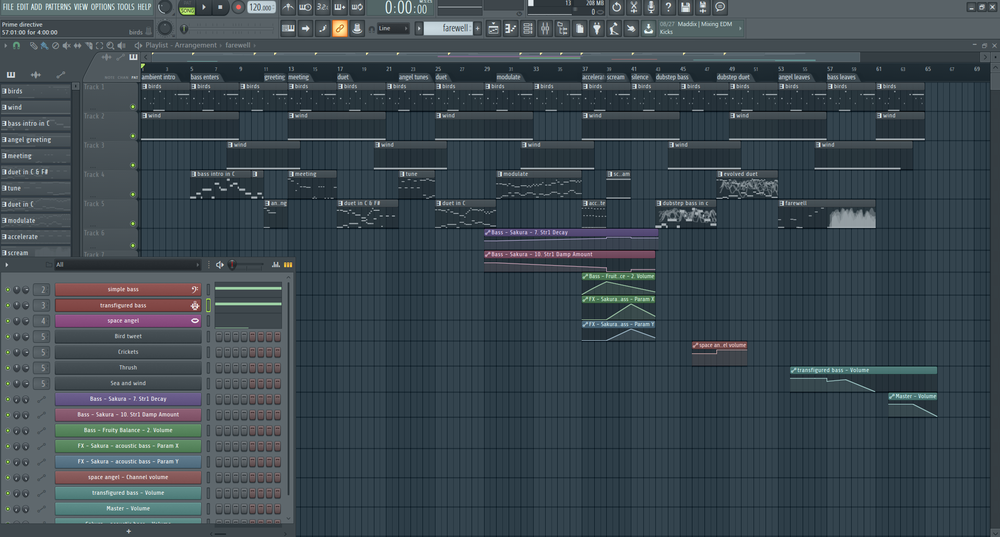
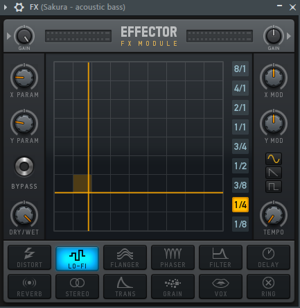

This article describes the inspiration, design, and construction of an abstract animation music video using _Blender_.

This was done as an assignment for the course Music Technology 2A at UCT.

## The final product
Below is the animated music video I made:

http://www.youtube.com/watch?v=F_PfTrxxxzo

You can download the FL Studio (FLS) project file to see how the audio was made. [FL Studio 20](https://www.image-line.com/downloads/flstudiodownload.html) runs on Apple & Windows and the project can be viewed and played for free (but not saved with the free FLS version).

The [Blender](https://www.blender.org/download/) animation file is also available below for download. It needs Blender version 2.79 (the latest at the time of writing). Later versions of Blender use a new rendering engine that won't work with this file.

### Download:
[Blender 2.79 project file](./animation.blend)

[MP3](2018-09%20-%20Richard%20JE%20Cooke%20-%20Prime%20Directive%20-%20Version%206.mp3)

[FLS 20 project file](2018-09%20-%20Richard%20JE%20Cooke%20-%20Prime%20Directive%20-%20Version%206.flp)

## Inspiration
I began my search for ideas by looking for purely abstractly animated music videos.

I knew I didn't want to use illustrations or photographs as I had done that last year for another music video project.
Instead this work would be done manually on computer or programmatically in code.

### 2D animation

#### Dots

My first inspiration was early abstract animation music videos. The best example of this is Norman McLaren's [_Dots_](https://www.youtube.com/watch?v=E3-vsKwQ0Cg) (1), shown below:

http://www.youtube.com/watch?v=E3-vsKwQ0Cg

This video has some noteworthy features:

* it is 2D (making it much simpler to create than a 3D animation where physics and camera positioning matter)
* shapes move, scale, and rotate (this is simple to do on computer)
* shapes morph from one shape to another (this may be the same amount of work by hand as scale and rotation, but on a computer it requires much more work to draw two different shapes and tween all the points in between them)
* the animation is synchronised to the beat of the music (this is more work than having a freely moving animation because you have to coordinate visuals and music precisely to the millisecond).

### 3D animation

#### Sliced
I then looked for 3D abstract animation and found SLICED by [dxmiq](https://vimeo.com/69668299) (2).

This looks pretty and impressive but I imagine is quite simple to make.
I would simply draw a long line of shapes and then automate the camera to move down the line, with a clipping plane "slicing" the shapes as the camera passes along them.

#### Annihilation
An example of Hollywood level commercial production is the fantastic work by _Milk_ _VFX_ on the film [_Annihilation_](https://www.youtube.com/watch?v=L6gwu8cOfVk), created in _Houdini_ (3).

http://www.youtube.com/watch?v=L6gwu8cOfVk

This is obviously the ultimate goal for a musical animation, but is possible only with a paid experienced VFX team, and weeks of paid rendering on a server farm.

This video also is the basis for my musical inspiration.
It is synthesized, complex, and vague, but has clear melodic elements and rhythm.

### Programmatic animation

#### Preflight nerves
I had made an application for _TEDx Cape Town_ a few years ago that pulled tweets from _Twitter_ that were tagged with the conference hashtag and displayed them on a giant projector on the wall.
I thought about something similar for a music video and searched to see if anything like this had been done before. It has, by Brightly for their song [_Preflight nerves_](https://www.youtube.com/watch?v=hMaeY0aP1xQ) (4):

http://www.youtube.com/watch?v=hMaeY0aP1xQ

The video above is static, but the one on their [website](http://tweetflight.wearebrightly.com) pulls fresh tweets to match the song lyrics in realtime each time you play it.

#### Dennis

I then discovered the most impressive video yet. [_Dennis_](http://www.dennis.video) is a procedurally generated 3D animated, gesture interactive, beat synchronised music video (5).

The animation was programmed in [three.js](https://threejs.org/).

It is very smooth and quick to render as it uses modern web browsers' support for the graphics processing unit (GPU) by using WebGL.
Finally, the animation was synchronised to the beat of the song by using WebAudio's native analysis capability.

This video shows the power you have when you don't have to animate every shape manually, but can write code to create and manipulate the shapes and camera for you.

## Software tools
After getting some idea of what could be created I began to look for free software tools to work in.

### 2D animation

#### Synfig Studio

For 2D vector animation the best tool I could find was Synfig Studio (6).

Synfig allows you to draw complex vector shapes directly into the application or import external images.
Each object's properties (e.g. size, rotation, outline, color, etc.) can be independently altered at any point (keyframe) in an animation of any length.
Synfig will then automically fill in (tween) the animation between each keyframe.
It also supports advanced functions like masking layers, blend modes, duplication and time manipuation, and skeleton animation.

Synfig would be the perfect tool to make something simple like _Dots_ and I was able to work through all the tutorials in a day.

#### two.js

For 2D programmatic animation the best framework I found was [two.js](https://two.js.org/examples/) (7).

two.js would be best for creating a video like _Dots_ but with much more complexity and movement, or for creating something with text, like _Preflight nerves_.

### 3D animation

#### Blender & Grease Pencil

[Blender](https://www.blender.org) is the undisputed champion of free 3D modelling and animation software.
It has been around for years and its features rival industry standards like _Maya_.

Recently Blender has also added powerful capabilities for beautiful 2D illustrated animations through its [_grease pencil_](https://vimeo.com/155635261) tool (which used to be a simple way for animators to annotate their work quickly for later use) (8).

Plain Blender would be the best tool for making a video like _SLICED_.

Blender with Grease Pencil would be the best tool for making something like _Dots_, but with 3D effects.

The problem is that Blender takes at least a week of learning and practising to become proficient at the basics, and I didn't have the time or skill for that.

### Programmatic 3D animation

#### three.js

The best framework I could find for 3D programmatic animation was [three.js](https://threejs.org) (9).
It was used for the _Dennis_ video above and supports almost anything you could imagine.

Move your mouse through the birds in this [demo](https://threejs.org/examples/#webgl_gpgpu_birds) to scatter them.

There is a competitor made by Microsoft, called [Babylon.js](https://doc.babylonjs.com), which is more suited to game development as it simplifies commonly used functions like lighting, but three.js is well established.

## Construction
I decided to write a little story about an acoustic bass meeting a modern synthesiser and having a conversation/song.
The _Annihilation_ movie inspired me to finish the story by having the bass being transfigured into a more evolved creature by meeting the synthesiser.

### Audio
I wrote the audio in FLS as it is an excellent choice for making electronic music fast.

I particularly enjoy the ability to put snippets of MIDI and automation into a library of clips which can then be cloned, reused, and rearranged easily.
As far as I know no other DAW other than [Tracktion's Waveform](https://www.tracktion.com/products/waveform) and possibly [Studio One](https://www.presonus.com/products/Studio-One) can do this.

It also has a fully scalable vector graphic interface, and the hotkeys enable me to switch between the playlist and each MIDI clip incredibly quickly.

Below is an image of the track. You can zoom in to see the labels of each section.

The disadvantage of FLS compared to the other DAW I use, _Reaper_, is that it has poor routing. To overcome this, and route one MIDI clip to multiple instruments to create the complex sounds for each character in the animation, I used _Patcher_ for almost every instrument track.

Finally, _Effector_ is plugin that provides useful special effects, like bitcrushng, vocal formants, and flanging.

I wrote the music at 120 bpm so it was easy to synchronise with the video (where each second is simply two beats).

For the sounds themselves I used the _Sytrus_ and _Harmor_ synths with preset sounds to save as much time as possible.
I used only synthesizers, no samples, as I find it easier to work with MIDI.

### Video

I spend a few days writing the video in _three.js_ but quickly encountered difficulties.
It's hard to programmatically specify what you want to happen on screen if you can't see it and are completely new to 3D graphics.
Finding errors and fixing them is difficult. And documentation is lacking.

So I decided to switch to Blender. This took a week to learn from reading a couple of tutorials.
But the good thing was all my questions could be answered within an hour by asking on the forum, so I never got stuck on a problem.

Putting two shapes on the screen and using keyframes to animate them was easy.
The time consuming task was synchronising the video and audio.
I also had to learn some intermediate techniques:

- using an orthographic camera for the 2D section of the video, then switching to perspective for the 3D section
- animating the camera to move in a circle while tracking the center of the scene
- understanding the differences in the Internal and Cycles renderers and how to choose the right one and perform my renders in less than a day.

Finally, I didn't have time to do interesting textures or particle effects, which would have greatly improved the impressiveness of the evolved bass in the second half of the video. I tried these, but couldn't get them to work with my limited skills.

#### Converting .png to video

Blender outputs each frame as a png rather than exporting video, so if your computer restarts you don't lose hours of rendering.

To convert the .pngs and my mp3 file to a video I used the command:

`ffmpeg -framerate 60 -i temp%4d.png -i a.mp3 -start_number 0000  -vcodec libx264  -crf 16 -r 60  output.mp4`

## Critique & conclusion

Overall this was a useful experience and I learnt a great deal about animation and the available options.

The audio part took only a few hours and suits the idea I was trying to convey quite well.
The video is suited to the audio too, but is clearly the work of an absolute beginner in modelling and animation.
I think using simple abstract shapes allows the audience member's mind to freely interpret the experience.

However, I don't think this is much of a contribution to art overall.
While the idea is fun, it is not original, and the graphical execution would need a lot more work to make it of a professional standard.

## References
_All Internet resources were accessed on 25 September 2018._

* 1) YouTube - thecipo. Normal McLaren - Dots (1940) [Internet]. 2007. Available from: https://www.youtube.com/watch?v=E3-vsKwQ0Cg.

* 2) Vimeo - dxmiq. SLICED [Internet]. 2013. Available from: https://vimeo.com/69668299.

* 3) vfxblog.com. Mandelbulbs, mutations, and motion capture: the visual effects of Annihilation [Internet interview]. VFXBLOG. 2018. Available from: https://vfxblog.com/2018/03/12/mandelbulbs-mutations-and-motion-capture-the-visual-effects-of-annihilation/.

* 4) Medium.com - Charlie Gleason. Making An Interactive Music Video With WebGL [Internet]. 2015. Available from: https://medium.com/superhighfives/making-a-music-video-f60757ceb4cf.

* 5) Brower BM and popcorn_10. Dennis [Internet music video]. n.d. Available from: http://www.dennis.video/#about.

* 6) Synfig.org. Synfig Studio [Internet]. 2018. Available from: https://www.synfig.org.

* 7) Two.js [Internet]. 2018. Available from: https://two.js.org/examples.

* 8) Blender 2.79 manual. User Interface » Grease Pencil » Introduction [Internet]. 2018. Available from: https://docs.blender.org/manual/ko/dev/interface/grease_pencil/introduction.html.

* 9) Three.js [Internet]. 2018. Available from: https://threejs.org.
