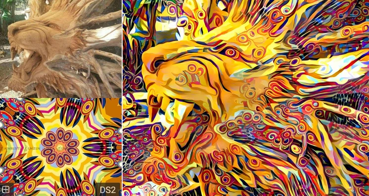
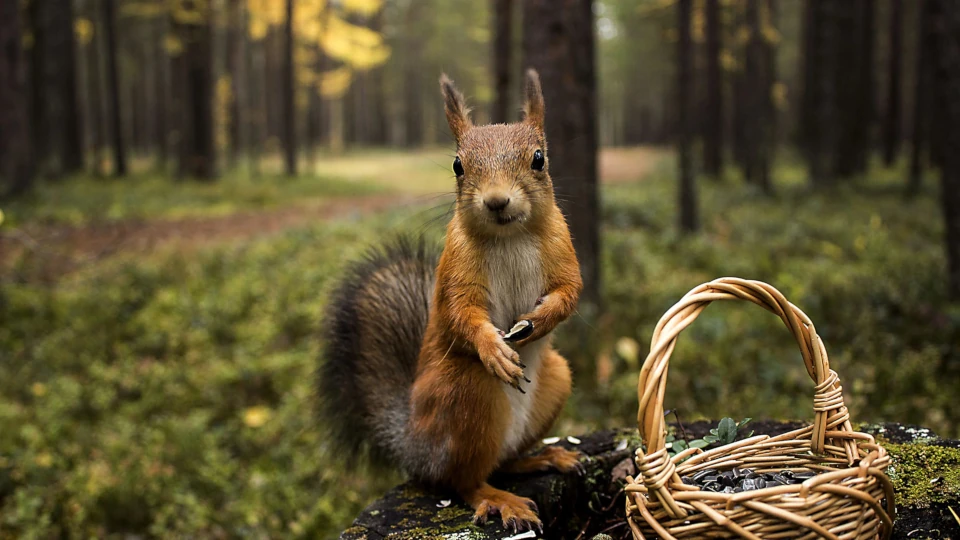
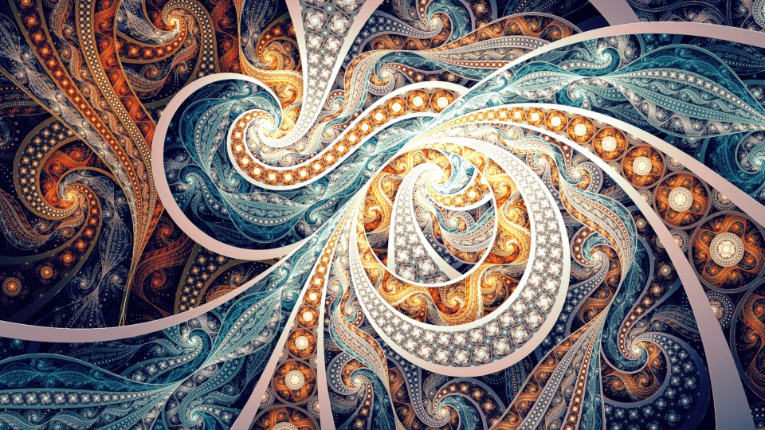
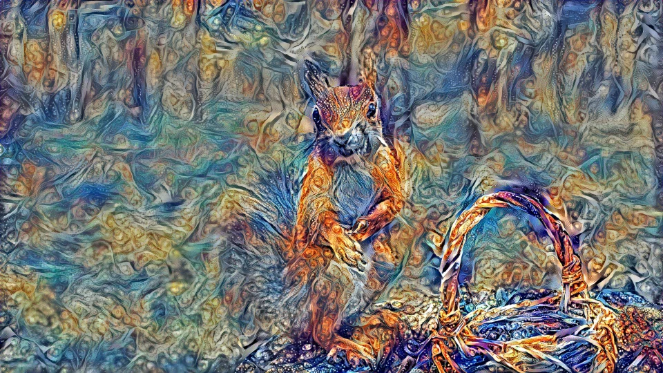
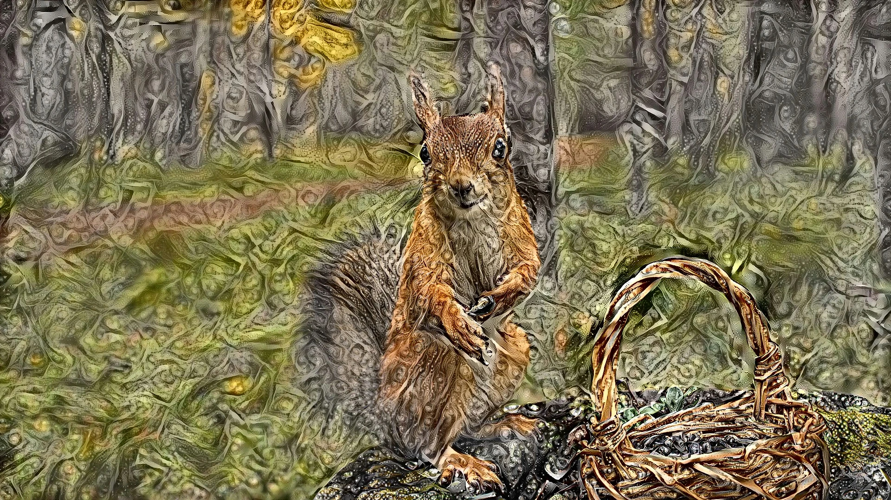

This article explains every step needed to create "deep style" neural art in the style of
[deep dream generator.com](https://deepdreamgenerator.com) on your own machine.

Deepdreamgenerator.com charges money to create high resolution art, but you can do it
at home for free.

Here's an example of their "neural style" - where you combine an input image with a guide (or texture) image:


## "Deep dream" versus "neural style"
There are two types of image merging to differentiate. Originally, Google developed
"deep dream", a surreal style that mostly looks like a painting made of shiny dogs.

Later, the "neural style" was created (called "deep style" on deepdreamgenerator.com). This avoids the
dogs and looks more like the image above. It's also called "style transfer".

## Why Docker isn't a great option
At first, you might want to download a virtual machine or Docker image that has all the software you need
already configured. There are lots of images available on [hub.docker.com](https://hub.docker.com/search?q=neural-style) if you search
for the terms in the last section.

However, the image merge process is highly GPU intensive. If you try to use only your CPU it will take far too
long. And trying to install the NVIDIA CUDA framework inside a Docker image inside the WSL was more work than
just installing everything on my main machine.

If you want to try get your GPU to work in Docker look at this [article](https://www.logic2020.com/insight/tactical/wsl-docker-gpu-enabled-nvidia).

## How to install
These are instructions for Windows. If you're using Apple or Linux things should be similar with only a few changes.

Here we go:

- [Install CUDA on windows](https://developer.nvidia.com/cuda-downloads).
- [Register an account and download CUDNN](https://developer.nvidia.com/cudnn).
- Unzip CUDNN and copy the files in the `lib`, `bin`, and `include` folders to the corresponding folders in C:\Program Files\NVIDIA GPU Computing Toolkit\CUDA\v11.7.
- Download [zlib](https://zlib.net/), unzip it somewhere, and put that folder in your Windows PATH environment variable.
- Create a folder called something like `C:\dd` and downoad and extract the art library [here](https://github.com/anishathalye/neural-style) into it (code - download .zip). Keep this link open, as it contains documentation on the various settings you can tweak to alter your images.
- Download the [trained neural network file](https://www.vlfeat.org/matconvnet/models/imagenet-vgg-verydeep-19.mat) to this same folder.
- Create `C:\dd\images` folder.
- Put an image called `texture.jpg` and another called `input.jpg` into it. I found .webp and .png files didn't work.
Also start with images no bigger than 500KB, or less if you have little RAM. If they work, then try bigger images.
- Open a command prompt:
```powershell
winget install python3 # you may have to do this twice to get it to run
python   # to test it's installed
exit()
cd c:\dd
pip install -r requirements.txt
cls && python .\neural_style.py --content c:\dd\input.jpg --styles c:\dd\texture.jpg --output c:\dd\output.jpg --iterations 500 --overwrite
```
- I sometimes had to push enter on the last command as it hung.
- If this works then try more iterations and changing some settings:
`python .\neural_style.py --content c:\dd\input.jpg --styles c:\dd\texture.jpg --output c:\dd\output.jpg --iterations 1000 --overwrite --style-layer-weight-exp 2.0 --content-weight-blend 0.1 --preserve-colors`

## Problems
Here's an example of my input, texture, and output files (with and without color preservation):






We can see that choice of images makes a huge different to the appeal of the output. As do the merge settings.

Finally, I had trouble with images above 1920px resolution running out of memory.
I need to investigate if there's a way to do this slower, but with less RAM.
Otherwise there's no way to do resolutions detailed enough for large prints.

Anish Athalye recommends looking at [https://github.com/lengstrom/fast-style-transfer](https://github.com/lengstrom/fast-style-transfer) for faster processing with less memory.